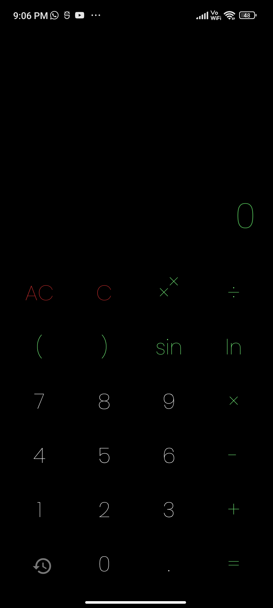

# 🟰 Calculator

A simple calculator android app with a sleek design built using kotlin language.

## 🛠️ Technologies Used

- Kotlin
- Room Database
- ViewBinding
- Google Fonts

## 🌠 Screenshot

## ⬇️ Download

Go to releases page and download the latest `app-release.apk` from the latest release tag.
